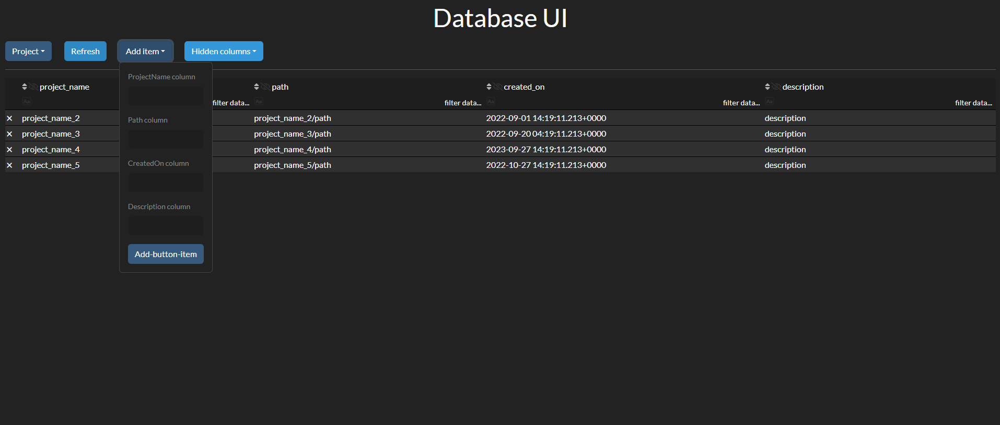

## User story
Graphical user interface for modifying database using Python Dash and Bootstrap  components. 

## Install 
- python -m venv .venv
- .\\.venv\\Scripts\\activate
- python install -r requirements.txt
- sqlite3 projects.db ".read  db_dumb.sql" (windows) / 
- sqlite3 projects.db < db_dumb.sql (linux)
- python app.py


## Data select
```bash
sqlite3 projects.db <<< SELECT * FROM project;
```

## Sample view
